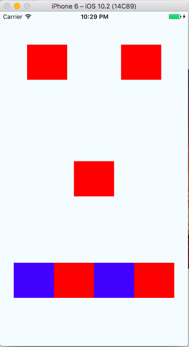

# React Native Intro

A workshop and introduction to react native.


## Objectives

* Describe what react native is useful for
* Use flexbox to style a react native app
* Get data from an api using fetch

## React Native: Background

### What is React Native?

React native is a framework for writing applications for mobile platforms.  The language you will primarily write in is JavaScript.  The framework allows you to quickly build and iterate on an application.

The project was created by Facebook after it launched react for the web.  It also has tremendous community support, with tons of open source contributors.

### Why React Native?

__Advantages__

* Shared code between iOS and Android
* More JS developers available than native developers
* Faster iteration when developing (hot reloading, easier to reason about state)
* Can prototype quickly

__Disadvantages__

* Not as performant as a pure native application.
* Fast paced community.  Lots of change

### How is React Native Different?

The react ecosystem is described as a learn once write anyone framework.  In other words, code may be slightly different on different platforms (web vs iOS vs android), but the fundamental ways that you build a react app are the same.  And hopefully many components that you create can be shared across the platforms.

This philosophy is in contrast to other frameworks like [Apache Cordova](https://cordova.apache.org/) that have tried to be a _write_ once and run anywhere framework.

The main difference between the two approaches is that react native apps actually compile down to native code.  In other words, the react native app that you create is very similar to implementing a native application on iOS or android.  In Cordova however, most of your code is run in a web view inside of a native container, so fundamentally, you are trying to make a webpage look like a mobile app.

## Getting Started

Facebook has some [great docs](https://facebook.github.io/react-native/docs/getting-started.html) for how to get started with react native.  Both the iOS setup and the android setup take some time though.

If you want to get started quickly, try [expo](https://docs.expo.io/versions/v15.0.0/introduction/installation.html).  It allows you to write a react native app without having xcode or android studio.


## Styling

React native has embraced flexbox for its styling needs.  To start on styling, we'll need to learn a few new components.

### New Components In React Native

If you are familiar with react in the browser, then you have probably written JSX.  It allows you to write html tags within your JavaScript code.  In react native, however, we are not writing code for the web.  A JSX component in react for the web might look something like this:

```js
import React, { Component } from 'react';
import ReactDOM from 'react-dom';
import './App.css'

export default class App extends Component {
  render() {
    return (
      <div style={styles.container}>
        <h3>
          This is a react web app!!
        <h3>
      </div>
    );
  }
}

ReactDOM.render(<App />, document.getElementById('root'));
```

However, react native will not have access to the `react-dom`.  There is no DOM for mobile applications.  Therefore, we have different components that we will use in react native.  Here is an example react native component:

```js
import React, { Component } from 'react';
import { Text, View, StyleSheet } from 'react-native';
import { Constants } from 'expo';

export default class App extends Component {
  render() {
    return (
      <View style={styles.container}>
        <Text style={styles.paragraph}>
          Phone connected! Change this code in Replit, press run, and watch it change on your phone.
        </Text>
      </View>
    );
  }
}

const styles = StyleSheet.create({
  container: {
    flex: 1,
    alignItems: 'center',
    justifyContent: 'center',
    paddingTop: Constants.statusBarHeight,
    backgroundColor: '#ecf0f1',
  },
  paragraph: {
    margin: 24,
    fontSize: 18,
    fontWeight: 'bold',
    textAlign: 'center',
    color: '#34495e',
  },
});
```

In the example above, we are creating our own component called `App`.  Every react components always implement the `render` method to tell our application what to render on the screen.

There are 3 important pieces to understand in this example:

* __StyleSheet__: Useful for creating stylesheet objects.  Checks to make sure the values that are being passed are valid react styles.
* __View__: A container component.  You can think of it as a similar component to an html div
* __Text__: For showing text. Unlike the browser, our text must always be inside of a text component.

Let's talk about how we can change the styling in react native.

### React Native Styling

Many of the styles that you use in react native are very similar to what you'll use on the web.

For example, the following (hopefully familiar) styles exist in react native:

* height
* width
* backgroundColor
* margin
* padding
* fontSize
* fontWeight
* color

To add a style to a component, you can do a few things. Commonly, you'll import `StyleSheet` from `react-native` and use `StyleSheet.create` which accepts an object of styles.  Here is an example that gives text some styling:

```js
import React, { Component } from 'react';
import { Text, View, StyleSheet } from 'react-native';
import { Constants } from 'expo';

export default class MovieApp extends Component {
  render() {
    return (
      <View>
        <Text style={styles.text}>
          Welcome to React Native!
        </Text>
      </View>
    );
  }
}

const styles = StyleSheet.create({
  text: {
    color: '#ff0000',
    fontWeight: 'bold',
    fontSize: 50,
  },
});
```

Notice that the text has a style prop, that accepts a JavaScript object from `StyleSheet.create`.  We can also just put our styles inline:

```js
import React, { Component } from 'react';
import { Text, View, StyleSheet } from 'react-native';
import { Constants } from 'expo';

export default class MovieApp extends Component {
  render() {
    return (
      <View>
        <Text style={{
           color: '#ff0000',
           fontWeight: 'bold',
           fontSize: 50,
        }}>
          Welcome to React Native!
        </Text>
      </View>
    );
  }
}
```

We don't need to use `StyleSheet.create in this case because we are providing the style object directly to the Text component.  It is a good idea to use `StyleSheet.create` though because it checks to make sure the styles you provided in your objects are all valid react native styles.

One more thing you can do with styling is provide an array.  Say you'd like to override one style:


```
import React, { Component } from 'react';
import {
  AppRegistry,
  StyleSheet,
  Text,
  View
} from 'react-native';

export default class MovieApp extends Component {
  render() {
    return (
      <View>
        <Text style={[styles.text, {fontSize: 35}]}>
          Welcome to React Native!
        </Text>
      </View>
    );
  }
}

const styles = StyleSheet.create({
  text: {
    color: '#ff0000',
    fontWeight: 'bold',
    fontSize: 50,
  },
});

AppRegistry.registerComponent('MovieApp', () => MovieApp);

```

Since `fontSize: 35` is later in the array, it will overwrite the first style.

### Flexbox Styling


React native has embraced flexbox for its styling. In order to use flexbox, it's important to understand a few concepts:

#### flexDirection

Determines the primary axis for the flexbox flow.  By default the `flexDirection` is set to `column`, which means that elements on the page stack vertically  in the view.  The other option is `row`, which means that the elements are positioned next to each other in a row.

Try the following example and switch the flexDirection between row and column:

```
import React, { Component } from 'react';
import {
  AppRegistry,
  StyleSheet,
  Text,
  View
} from 'react-native';

export default class FirstApp extends Component {
  render() {
    return (
      <View style={styles.container}>
        <View style={styles.box} />
        <View style={styles.box} />
        <View style={styles.box} />
        <View style={styles.box} />
      </View>
    );
  }
}

const styles = StyleSheet.create({
  container: {
    flex: 1,
    justifyContent: 'space-around',
    alignItems: 'center',
    backgroundColor: '#F5FCFF',
    flexDirection: 'column'
  },
  boxR: {
    width: 70,
    height: 70,
    backgroundColor: 'red'
  }
});
```

#### justifyContent

Acts on the primary axis in the flexbox flow.  So if the primary direction is `flexDirection: 'column'` and content is `justifyContent: center` all of the items will be be bunched together in the center in the available vertical space.

However, if the flexDirection is `flexDirection: 'row'` and the content is `justifyContent: center`, all of the content will be bunched together in the center of the horizontal space

You can read all of the properties for `justifyContent` in the [MDN docs](https://developer.mozilla.org/en-US/docs/Web/CSS/justify-content)

#### alignItems

Acts on the secondary axis in the flexbox flow.  So if the flexDirection is ``flexDirection: 'column'`, `alignItems` will align horizontally, and if the flexDirection is `flexDirection: 'row'`, `alignItems` will align vertically.

You can check out the [MDN docs](https://developer.mozilla.org/en-US/docs/Web/CSS/align-items) for align items as well.

#### width and height

React native styling also supports width and height.  As of [February 2017](https://github.com/facebook/react-native/releases/tag/v0.42.0), react native supports percentages for widths and heights!  So you can now do something like this:

```
conatinerRow: {
    width: '100%',
    height: 100
}
```

#### flex

This property accepts a number and determines the proportion of the available space to occupy.  For example, if there are two elements, both with a value of `flex: 1`, the two elements will both be given have the space.  The value of flex doesn't exactly matter, just the proportion.  So the same behavior would happen if both elements have `flex: 0.5`.  You can read more about flex in [react native docs](https://facebook.github.io/react-native/docs/layout-props.html#flex)

#### flexbox

To get more practice with flexbox, try [flexbox froggy](http://flexboxfroggy.com/).  Not all of the styles on the site apply to react native (the reverse options don't exist for example), but much of them apply.

### Exercise

Try to make an application that looks like the following mock up:



### User Input

To allow the user to type something in, we need to use the `TextInput` component.  The facebook docs for `TextInput` are [here](https://facebook.github.io/react-native/docs/textinput.html).

Here is a simple example:

```js
import React, {Component} from 'react';
import { Text, TextInput, View, StyleSheet } from 'react-native';

export default class TextInputExample extends Component {
  constructor(props) {
    super(props);
    this.state = { text: 'Hello World' };
  }

  render() {
    return (
      <View style={{flex: 1, alignItems: 'center', justifyContent: 'space-around'}}>
        <TextInput
                style={{height: 40, borderColor: 'gray', borderWidth: 1}}
                onChangeText={(text) => this.setState({text})}
                value={this.state.text}
              />
        <Text>text: {this.state.text}</Text>
      </View>
    );
  }
}
```

Notice that the prop for changing the value of an input is `onChangeText`.  Also, always remember to give your `TextInput` a height or it will not display on iOS.

### React Native Buttons

React native provides a `Button` component, however the button component does not allow any customization.  You can see the docs for the button on [facebook here](https://facebook.github.io/react-native/docs/button.html).  The button is designed not to be customizable because it is supposed to look like the native button on iOS or on Android.  The button component takes care of the platform specific styling.

Sometimes you want a custom experience for you buttons though.  To create your own custom button, use `TouchableOpacity`.  Below is a custom button component that uses `TouchableOpacity` to wrap a Text component.  You can also use icons, images, etc inside of `TouchableOpacity`.

```js
import React, { Component } from 'react';
import {
  TouchableOpacity,
  Text,
  StyleSheet,
  View
} from 'react-native';

class CustomButton extends Component {
  render() {
    return (
      <TouchableOpacity
        style={buttonStyles.buttonContainer}
        onPress={this.props.onPress}>
        <Text style={buttonStyles.buttonText}>
          {this.props.title}
        </Text>
      </TouchableOpacity>
    );
  }
}

const buttonStyles = StyleSheet.create({
  buttonContainer: {
    borderRadius: 4,
    backgroundColor: "blue",
    padding:10
  },
  buttonText: {
    color: 'white',
    fontSize: 25
  }
});

export default class App extends Component {
  render() {
    return (
      <View style={{flex: 1, justifyContent: 'center'}}>
        <CustomButton title="Hello World" onPress={() => null}/>
      </View>
    );
  }
}
```

### ScrollView

To display a list of data, you could use a scroll view.  Scroll Views are simple to use.  You can put the data you want inside of the `ScrollView` component, just like a view:


```
<ScrollView>
	<Text>Item 1</Text>
	<Text>Item 2</Text>
	<Text>Item 3</Text>
</ScrollView>
```

To see all the properties that you can set on a scroll view, checkout the [facebook docs](https://facebook.github.io/react-native/docs/scrollview.html)

### Fetch

React native developers often use the `fetch` api to make HTTP GET requests.  Typically, we make our get requests inside of a lifecycle method called `componentDidMount`:

```js
// assume there is some state for our movie data
componentDidMount() {
	const title = encodeURIComponent(this.state.title);
	fetch(`http://netflixroulette.net/api/api.php?title={title}`)
		.then(d => d.json)
		.then(d => {
			this.setState({movie: d});
		});
}
```


## Actors in Movies Application

Let's take a look at an example application.  All of the code for the app is located in the [Actors in Movies](https://github.com/rithmschool/React-Native-Actors-In-Movies) repository.


### Directory Structure For a React Native App

To get up and running for our first app, let's use the expo app and [repl.it](https://repl.it/languages/react_native)

The cli will create a directory called MoviesApp. Inside of it, you will get the following files:

* __package.json__: Lists our javascript dependencies.  This is what gets edited when you do `npm install --save <module_name>`
* __index.ios.js__: The entry point to our ios app.  We can put ios specific setup here.
* __index.android.js__: The entry point to our android app.  Android specific setup can go here
* __.babelrc__: The config file for babel (a transpiling library)
* __.flowconfig__: Flow is a static type checker than you can use in your app.  Find out more from [facebook](https://flowtype.org/)
* __node_modules__: A directory that contains all of our JS dependencies.
* __ios__: A directory that contains build settings for iOS. The xcode project will be found here.
* __android__: A directory that contains build settings for android. The gradle build scrips will be in here.

The expo files will be a little different.  Instead of `index.ios.js` and `index.android.js` you will get a file called `'main.js`
